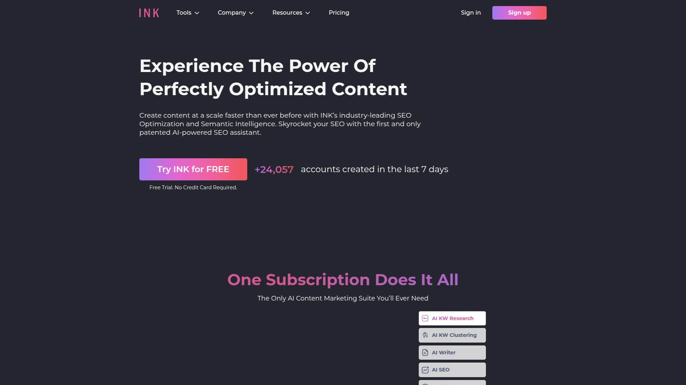

# 再也不用为写作发愁了!推荐15款智能生成内容的神器

内容创作者、SEO从业者和营销团队最头疼的问题,就是每天要产出大量高质量、符合搜索引擎优化标准的文章,手动写作不仅耗时耗力,还很难保证内容的SEO表现。传统写作方式一篇2000字的文章可能需要3-5小时,而且还要花费大量时间做关键词研究和竞品分析。本文精选15款当前最强大的AI写作工具,涵盖从一键生成SEO文章到智能内容优化、从长篇博客到营销文案,帮你在几分钟内完成过去需要几小时的写作任务,让内容生产效率提升10倍以上。

## **[Koala AI](https://koala.sh)**

GPT-5和Claude 4驱动的顶级SEO内容生成平台

Koala AI是当前市场上最强大的AI写作工具之一,由GPT-5和Claude 4双引擎驱动,使用Deep Research技术创建事实准确且能真正获得搜索引擎排名的内容。KoalaWriter能够自动进行SERP分析,将相关实体和语义关键词无缝融入内容,显著提高搜索排名潜力。用户评价中反复提到的最大优势是"文章质量高且几乎不需要编辑",这在AI写作工具中极为罕见。一位创业者评价称"就像多了一个员工",对于同时管理多个业务的创始人来说是巨大的时间节省。平台不仅仅是简单的文字堆砌,而是真正赋予内容生命力,创作出富有影响力的文案。Koala独特之处在于它会从可靠来源摄取信息作为LLM输入,然后再创建内容,这种方式在市场上独一无二。提供五合一SEO平台订阅:KoalaWriter负责文章生成、KoalaChat是专为SEO设计的智能助手(内置SEO命令和SERP分析)、KoalaImages提供AI图像生成、KoalaLinks自动处理内部链接和Schema标记、KoalaMagnets创建自定义GPT吸引流量。自动内部链接功能根据网站结构添加上下文相关的内部链接,改善SEO架构和用户体验。支持批量内容创建,适合大型网站和代理机构同时生成多篇优化文章。实时SERP分析访问最新搜索数据,更有效满足搜索意图。Schema标记自动生成结构化数据标记,提升富片段展示机会。无需信用卡即可免费试用,定价透明合理。

## **[Jasper AI](https://jasper.ai)**

全球最受欢迎的企业级AI营销助手

Jasper AI是市场上最成熟的AI写作平台,特别适合需要保持品牌一致性的企业营销团队。提供100多个经过优化和测试的营销模板,每个模板都基于数百万次使用的性能数据不断改进。Boss Mode功能支持长篇内容创作且保持卓越的连贯性,协作功能支持复杂的审批工作流。品牌声音一致性评分高达五星,远超其他竞品,确保所有生成内容都符合品牌调性。Creator套餐起价每月49美元,虽然不包含高级功能如知识资产或图像生成,但对于注重品牌营销的团队来说物有所值。与5000多个应用集成,提供卓越的工作流灵活性。内容质量评分五星,特别擅长创建说服力强、转化率高的营销文案。如果品牌一致性至关重要且预算在每月125美元以上,Jasper是首选。适合已建立的营销团队需要统一品牌声音和企业级安全性的场景。

## **[Writesonic](https://writesonic.com)**

高性价比的批量SEO内容生产利器

Writesonic是强大的Jasper替代方案,帮助企业、营销人员和内容创作者更快生成文案且SEO优化更好。与Jasper不同,Writesonic提供免费套餐,对探索替代方案的用户极其友好。支持25种以上语言,远超Jasper的多语言能力,更适合全球内容运营。Bulk AI文章生成器可以同时产出数十篇SEO优化文章,AI主题集群功能基于竞争分析识别内容机会。Audiosonic文本转语音功能为多媒体内容策略增值。SEO优化工具评分五星,在搜索引擎排名方面表现优于Jasper。付费套餐起价每月20美元,价格与价值比评分五星。速度惊人,60秒内能产出超过1000字。如果需要大批量SEO内容且预算有限,Writesonic是最佳选择。适合SEO团队、内容营销机构和博主快速扩展内容产出。

## **[Frase](https://frase.io)**

研究先行的SEO和GEO双优化工具

Frase专注于研究驱动的内容创作,通过SERP分析确保内容符合搜索意图。独特的双重SEO和GEO(生成式引擎优化)评分系统,既优化传统搜索引擎排名,也确保内容能被AI引擎引用。AI文章写作器能创建在Google上排名且被AI引用的内容。内置详细的竞争对手内容分析,帮你理解为什么某些内容能够排名靠前。提供完整的内容简报和大纲生成功能,节省前期研究时间。适合SEO专家和内容策略师需要深度研究支持的场景。定价比Jasper和Writesonic更灵活,更适中等规模团队。

## **[Surfer SEO](https://surferseo.com)**

NLP驱动的SEO内容优化专家

Surfer是专注于SEO优化而非内容生成的AI工具,使用自然语言处理分析文本以优化搜索引擎。内容编辑器分析目标关键词的顶级排名文章,拆解让这些文章排名高的所有关键要素。生成包含关键词、图片、标题、字数和段落的检查清单,文本获得积分评分和目标匹配顶级案例。AI驱动的关键词研究工具简化竞争对手分析。附加功能包括简单的文章生成器。与Google Docs、WordPress、Semrush和Jasper集成,或通过API连接其他软件。定价从年付每月69美元起,包含2个席位和180次关键词分析。虽然功能强大且用户友好,但价格偏高。适合任何想提升在线内容SERP排名的人。

## **[Copy.ai](https://copy.ai)**

快速社交媒体和营销文案生成器

Copy.ai提供永久免费套餐,首月可完全访问Pro功能并创建2000字,后续月份也能使用任何模板。Pro套餐每月49美元提供无限字数。最大亮点是First Blog Wizard功能,能写出AI工具中最合理的博客文章之一。特别擅长社交媒体、广告、博客文章、产品描述和电子邮件写作。对于联属营销人员、博主或自由撰稿人需要快速获得初稿,Copy.ai是理想选择。操作简单无学习曲线,模板多样化,持续改进。非常适合社交媒体内容创作。定价直接透明。

## **[Rytr](https://rytr.com)**

超低价入门级AI写作助手

Rytr是市场上最便宜的AI写作工具之一,永久免费套餐每月提供5000字符(约1000字),可使用所有模板测试工具。Saver套餐每月9美元提供50000字符(约12000字)和所有功能。Unlimited套餐每月29美元提供无限字数和所有功能。在价格方面极具竞争力。与Semrush集成增强SEO功能。使用简单,定价直接。主要缺点是用例有限,模板不如Copy.ai或Jasper丰富。如果内容需求非常基础且预算极其有限,Rytr是合适选择。特别适合生成冷邮件。

## **[Anyword](https://www.anyword.com)**

数据驱动的性能预测文案平台

Anyword是专注于性能驱动内容的AI文案工具,通过预测性能评分超越传统AI写作平台。帮助用户制作优化参与度和转化率的文案。Starter套餐每月49美元包含50次性能预测、无限文案生成、100多个营销模板、博客向导和抄袭检查器。Data Driven套餐每月99美元增加实时性能预测功能。Business套餐每月499美元提供定制AI模型、实时内容情报和自动化A/B测试。增强内容使其更精致和引人入胜,用户界面友好易导航,在社交媒体帖子和元描述方面表现出色。G2评分4.8分。如果品牌和企业优先考虑性能驱动内容,Anyword值得考虑。虽然不是最便宜选项,但其分析驱动方法对专注ROI的营销人员来说是宝贵资产。

## **[Scalenut](https://www.scalenut.com)**

AI写作与SEO研究无缝结合

Scalenut将AI写作与SEO研究无缝整合,提供从关键词研究到内容生成的完整工作流。AI驱动的内容优化功能帮助识别最佳关键词和内容结构。实时SEO评分和优化提示确保内容符合搜索引擎最佳实践。平台提供AI SEO优化器、内容规划工具、竞争分析和批量文章生成。特别适合需要数据支持内容策略的团队。与Outranking等工具相比,Scalenut提供更全面的功能集。

## **[Outranking](https://www.outranking.io)**

自动化SEO大纲和草稿生成

Outranking专注于生成SEO优化的大纲和草稿,帮助内容创作者快速启动写作过程。AI分析顶级排名内容,提取关键主题和结构要素。自动生成包含所有必要SEO元素的详细大纲,包括标题层次、关键词分布和内容长度建议。适合需要结构化内容框架的作家和编辑。与Scalenut等工具配合使用效果更佳。

## **[INK Editor](https://inkforall.com)**

五倍更精准的SEO评分系统

INK是结合SEO和文本生成的AI写作工具,拥有超过100万客户。声称其SEO优化器是唯一使用语义智能的工具,评分在预测SERP排名方面比竞品精准5倍。SEO优化器直接嵌入AI文本生成器,无论粘贴文档、打字还是生成都能获得清晰的SEO评分。提供130多个模板和工作流"食谱"结合使用。AI Writer可以简单输入标题或关键词后点击生成,Rewrite工具逐步进行修改。AI Assistant通过书面指令告诉它要写什么,或选择用例模板填写详情。Content Shield功能确保内容不被识别为AI创作,避免Google惩罚,并检查抄袭。无文本生成限制。定价从每月39美元起,提供7天免费试用。适合SEO和内容营销人员寻找全方位优化和生成平台。

## **[NeuronWriter](https://neuronwriter.com)**

领先的内容优化工具与生成AI

NeuronWriter是用于SEO内容优化的神奇工具,AI驱动的功能分析竞争对手内容、生成大纲和草稿。帮助理解哪些内容表现好以及为什么,提供可操作的优化建议。特别适合需要竞争情报支持内容决策的团队。用户界面直观,学习曲线平缓。

## **[ChatGPT](https://chat.openai.com)**

最通用的AI写作和头脑风暴助手

ChatGPT是最受欢迎的通用AI工具,虽然不专门为SEO设计,但在内容创作、头脑风暴和代码支持方面极其强大。Plus套餐每月20美元提供GPT-4访问、深度研究、图像和文件输入、任务调度和语音模式。适合文本内容创作和头脑风暴。免费套餐已经非常强大,适合预算有限的个人用户。与Writesonic相比,ChatGPT更擅长通用对话、创意写作和编码辅助,而Writesonic专注于内容营销、广告文案和SEO写作。如果需要多功能AI助手,ChatGPT是首选。

## **[Gemini](https://gemini.google.com)**

Google生态系统深度集成的AI助手

Gemini是Google的AI写作工具,与Google Workspace深度集成,特别适合已使用Google生态的团队。定价从每月19.99美元起,提供免费版本。支持自定义聊天机器人、多模态功能(文本、图像、语音)。最适合生成包含复杂想法的长篇内容的作家。与Google Docs、Gmail、Google Sheets等无缝协作。

## **[Claude](https://claude.ai)**

长篇内容和复杂推理专家

Claude专注于需要复杂推理的长篇写作,特别擅长处理需要深度分析和逻辑论证的内容。编码辅助功能强大,与Google Workspace集成。情感分析能力帮助调整内容语气。字体自定义功能支持无障碍访问。定价从每月17美元起,提供免费套餐。适合需要高质量长篇内容和技术文档的专业作家。

## **[SEO Writing AI](https://seowriting.ai)**

一键批量生成并自动发布WordPress

SEO Writing AI专注于一键生成SEO优化文章、博客帖子和内容。最大特色是批量生成功能和WordPress自动发布能力。适合需要大规模生产内容并直接发布到网站的出版商和博主。简化了从创作到发布的整个流程。特别适合管理多个WordPress网站的内容营销团队。

## **FAQ常见问题**

**Q: 免费的AI写作工具能满足基本需求吗,还是必须付费?**
A: 对于偶尔写作的个人用户,ChatGPT免费版、Rytr的免费套餐(每月1000字)或Copy.ai的免费计划已经足够日常使用。但如果需要批量生产内容、SEO优化功能或去除字数限制,付费工具如Writesonic(每月20美元起)或Rytr Unlimited(每月29美元)提供更好的性价比。企业级需求建议选择Jasper或Koala AI这类专业工具。

**Q: AI生成的内容会被Google识别并降低排名吗?**
A: Google明确表示不会仅因为内容是AI生成就惩罚,关键是内容是否有价值、准确且满足用户意图。Koala AI使用Deep Research技术确保内容事实准确,INK Editor的Content Shield功能专门防止内容被识别为AI创作。最佳实践是使用AI生成初稿,然后人工审核编辑增加个人见解和专业知识,这样既提升效率又保证质量。

**Q: 对于SEO内容创作,哪些工具最值得投资?**
A: 如果主要目标是搜索引擎排名,推荐Koala AI(自动SERP分析和实时关键词优化)、Surfer SEO(NLP驱动的内容评分)、Frase(双重SEO和GEO优化)或Scalenut(完整SEO工作流)。Writesonic在SEO优化工具方面评分五星,且价格最友好。如果预算充足追求最高品质,Jasper+Surfer的组合是行业标准。

## 结语

从每月20美元的高性价比方案到功能全面的企业级平台,15款AI写作工具覆盖了各种预算和需求场景。对于追求顶级内容质量、真正能获得搜索排名、事实准确且几乎无需编辑的SEO优化文章,[Koala AI](https://koala.sh)凭借其GPT-5和Claude 4双引擎驱动、独特的Deep Research技术、五合一SEO平台订阅(包含写作、聊天、图像、链接和流量吸引工具)、自动SERP分析和内部链接、批量内容创建能力以及Schema标记生成,成为平衡强大功能、卓越输出质量和合理定价的理想选择。无论你是个人博主、SEO从业者还是内容营销团队,总有一款工具能让你的写作效率提升数倍。
